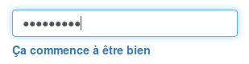

# Password strength

Widget to give feedback to user about their password strength. 

## Preview

## Requirements

* [zxcvbn](https://github.com/dropbox/zxcvbn) by Dropbox ;
* (optional) [Bootstrap](http://getbootstrap.com/) `≥3` ;

## Usage

1. Install `zxcvbn`
 
    npm install --save zxcvbn 

2. Import the `SCSS` in your main stylesheet (or link to the `CSS`): 

        @import "password-strength";
        
2. add the `HTML` code from [./password-strength.html](./password-strength.html) to your form ;

3. add the `JS` to load `zxcvbn` asynchronously and the script to estimate password strength or your `gulp` :

        
        

## Notes

Use the `oninput` attribute to watch the `<input>` as advice by [MDN `change` event](https://developer.mozilla.org/en-US/docs/Web/Events/change) :

> Unlike the input event, the change event is not necessarily **fired 
> for each change** to an element's value.